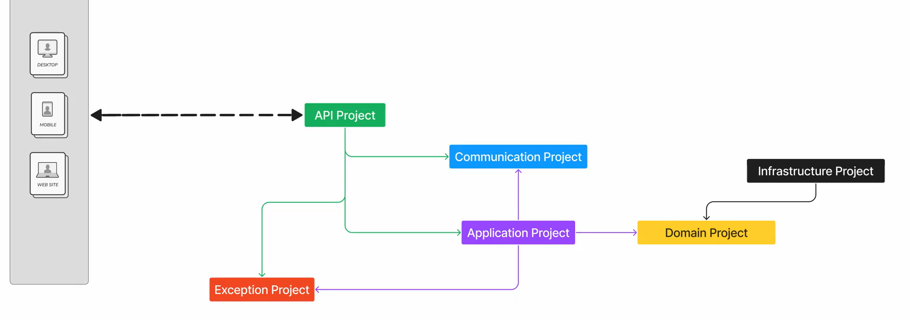
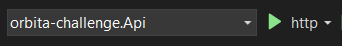

# Desafio Full Stack - Grupo +A Educação

## Sobre o Projeto

Esta aplicação foi desenvolvida com o objetivo de registrar e gerenciar matrículas de alunos em uma plataforma educacional. O sistema permite que os usuários se cadastrem, visualizem e editem informações sobre os alunos matriculados em turmas.

A arquitetura adotada segue os princípios do **Domain-Driven Design (DDD)**, que visa uma estruturação clara e eficaz do código, facilitando a manutenção e a escalabilidade do sistema.

## Arquitetura Utilizada

A aplicação segue o padrão **Domain-Driven Design (DDD)**, que organiza o código em torno de um modelo de domínio central, garantindo que as regras de negócio sejam bem definidas e de fácil manutenção. A arquitetura foi dividida em várias camadas e pastas que são responsáveis por diferentes aspectos da aplicação. A estrutura do projeto é composta pelas seguintes camadas:

1. **API**:  
   A camada da API é responsável por expor os endpoints que o frontend consome.

2. **Application**:  
   A camada de aplicação contém a lógica de orquestração da aplicação.

3. **Communication**:  
   A camada de comunicação gerencia as interações entre diferentes sistemas ou microserviços.

4. **Domain**:  
   A camada de domínio é o coração do sistema, onde as regras de negócio são definidas.

5. **Exception**:  
   A camada de exceções é responsável pelo tratamento de erros e exceções ao longo de toda a aplicação.

6. **Infrastructure**:  
   A camada de infraestrutura é responsável pela persistência de dados e integração com serviços externos.

7. **Tests**:  
   A camada de testes contém todos os testes unitários.

## Imagem da arquitetura


---

## Tecnologias e Bibliotecas Utilizadas 
## **Backend**:

- **.NET 8**: Plataforma de desenvolvimento para criar APIs e aplicações web.
- **Entity Framework**: ORM que facilita a interação com o banco de dados.
- **Swagger**: Documentação interativa para APIs.
- **JWT**: Padrão para autenticação e autorização de usuários.
- **AutoMapper**: Mapeia objetos de tipos diferentes de forma simples.
- **BCrypt**: Biblioteca para hashing de senhas, garantindo segurança.
- **Moq**: Framework para criar mocks em testes unitários.
- **Bogus**: Gera dados falsos para testes.
- **XUnit**: Framework para escrever e rodar testes unitários.

## **Frontend**:

- **Vue.js**: Framework para construir interfaces de usuário reativas.
- **TypeScript**: Superset de JavaScript com tipagem estática.
- **Vuetify**: Biblioteca de componentes UI baseada no Material Design.
- **Axios**: Biblioteca para realizar requisições HTTP.
- **Vue Router**: Sistema de navegação para aplicações SPA.
- **Vite**: Ferramenta de build rápida e otimizada.
- **Vue-toastification**: Biblioteca para exibir notificações ao usuário.
- **Vitest**: Framework de testes para Vue.js.


# Demonstração do Funcionamento do Projeto

Abaixo, você pode encontrar um link para o vídeo que demonstra o funcionamento completo do projeto, incluindo as principais funcionalidades e fluxo de navegação.

**https://youtu.be/hlrcuMApamA**

# Guia de Instalação e Configuração 

Siga os passos abaixo para configurar e executar o projeto:

1. Clone o repositório do projeto:

  ```sh
  git clone https://github.com/IanHadrien/orbita-challenge-full-stack-web.git
  ```

  2. Acesse o diretório do projeto:
  ```sh
  cd orbita-challenge-full-stack-web
  ```

  3. Acesse o arquivo **appsettings.json**, localizado na pasta **orbita-challenge.Api**.
Atualize o campo Connection com os detalhes do seu banco de dados. Exemplo de configuração para um ambiente local:.
  ```sh
  "Connection": "Server=localhost;Database=orbita-challenge;Uid=root;Pwd=;"
  ```

  4. Ceritfique de rodar o projeto na pasta informada logo a baixo:
  <br>
 
---

 5. Depois de executar o backend, dentro do projeto Front, acesse a pasta **plugins** e acesse o arquivo **axios** e altere para a url gerada pela sua api:
   ```sh
   const url = "http://localhost:5053/api"
   ```
  6. Acessando o diretório FrontEnd do projeto:
   ```sh
   npm install
   ```
  7. Rodando o Projeto
   ```sh
   npm run dev
   ```

  8. Rodando os testes
   ```sh
   npm test
   ```

## Melhorias

### Backend

- **Aprimoramento retorno de erros**
- **Melhorar o testes**
- **Adicionar validações mais complexas para dados mais sensiveis**
- **Dockerizar para utilização da api com maior facilidade em outros ambientes**

### Frontend

- **Melhorar o tema dark em alguns componentes**:
- **Melhorar o monitoramento do token**:
- **Separar mais alguns componentes**:
- **Publicar**:
- **Melhorar a persistência**:
- **Melhorar os testes de componentes**:

